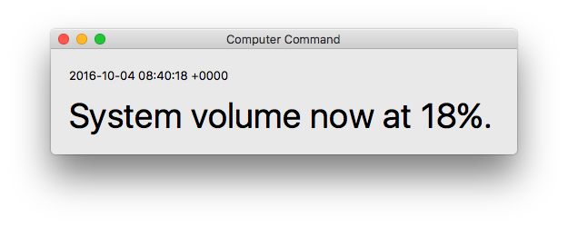

# Computer Command

A macOS app that allows an iOS device running [Computer Satellite][1] to control a Mac using voice commands provided. It's an experiment that's no longer maintained. 

## 

## Background

[Computer Satellite][1] was written back in 2012 as a primitive voice-controlled system. Once paired with Computer Command, it still works, albeit a little slowly. Plus, it uses those beautiful Star Trek LCARS computer beeps and that makes me very happy.

Unfortunately, I lost the PHP script that allowed Computer Satellite to talk to Computer Command, and so I reimplemented it in a much more modern way: using NodeJS.

## Usage

Simply open the Computer Command Xcode project, and build and run.

Install node.js, open Terminal and run `npm install` in the ccmd directory to install the node modules. Then run `node ccmd.js`.

Set up [Computer Satellite][1]. Without it you can't do anything unless you set up a program to send AppleScript commands to Computer Command, or HTTP POST requests to ccmd.js.

## How it works

1. ccmd.js receives a POST request from [Computer Satellite][1]. The request body is a JSON dictionary with 2 elements: the command `cmd` (usually `voice_ctrl`) and the query `q` (what was said, e.g. "MUTE AUDIO").
2. ccmd.js uses AppleScript to send the body to Computer Command, which gets passed to an instance of the `Transceiver` class.
3. `Transceiver`'s `-processInput:` method is called with the still-stringified JSON input.
4. A whole bunch of `-isEqualToString:`, `-hasPrefix:` and `-hasSuffix:` methods are called in order to decide what the input query was.
5. `-processInput:` returns a stringified JSON dictionary with its response.
6. ccmd.js responds to the POST request with this dictionary.

Essentially, [Computer Satellite][1] transcribes voice and tells Computer Command about it. At this point, I hadn't managed to figure out an easy way to do text-to-speech on OS X; OpenEars was only available on iOS.

## Adding actions

Simply add to the gigantic `-processInput:` method. 

## Final thoughts

This architecture obviously isn't the best, but it works. This was superseded by the Jarvis 1 architecture a few months after Computer Command was written.

[1]: https://github.com/taneliang/Computer-Satellite